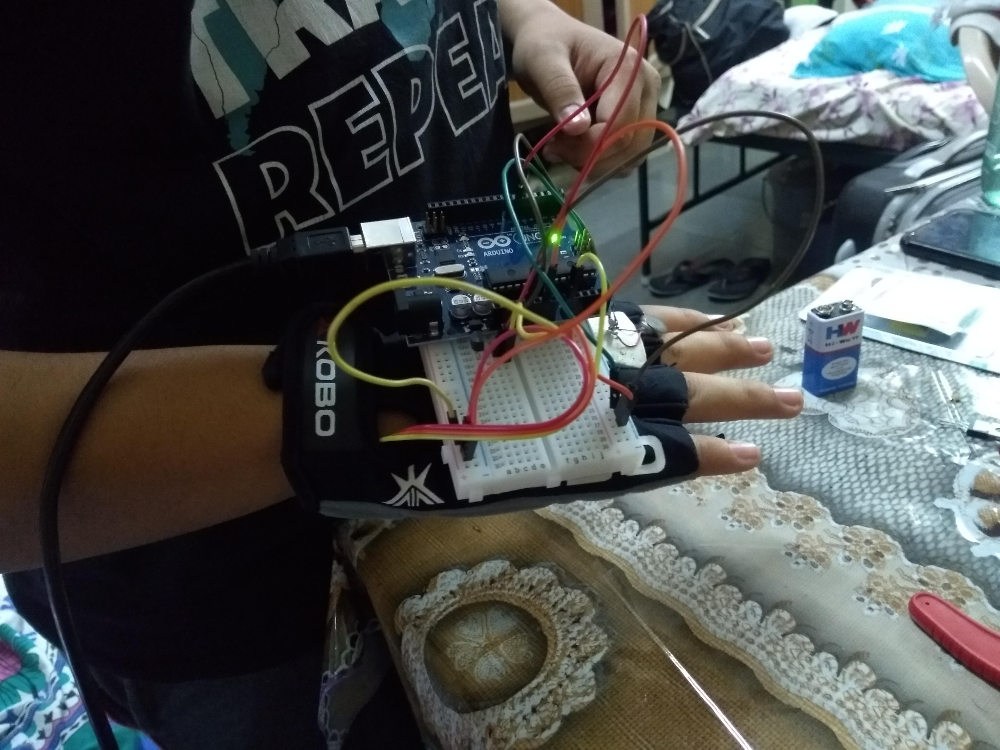

## Driver Drowsiness Detection System
The Driver Drowsiness Detection System is a biomedical project designed to monitor a driver's heart rate while operating a vehicle and prevent drowsiness-related accidents. The project utilizes a pulse sensor attached to the driver's finger to record their heart rate in real-time and trigger an alarm system if the heart rate falls below a certain threshold (in this case, 55 BPM, which is considered the drowsiness range).

The system uses an Arduino board to process the pulse sensor data and activate a vibration motor to provide a tactile stimulus to the driver, effectively waking them up from their drowsy state. The system is designed to be non-intrusive to ensure that the driver's attention is not drawn away from the road while still providing an effective mechanism to prevent accidents caused by driver fatigue.

## Features
- Utilizes a pulse sensor to monitor the driver's heart rate in real-time
- Triggers an alarm system if the heart rate falls below the drowsiness range
- Activates a vibration motor to provide a tactile stimulus to the driver
- Designed to be non-intrusive and not distract the driver

## Requirements
- Arduino board
- Pulse sensor
- Vibration motor
- Jumper wires
- Compatible computer system

## Installation and Usage
- Connect the pulse sensor to the Arduino board according to the pin configuration specified in the code.
- Connect the vibration motor to the Arduino board according to the pin configuration specified in the code.
- Upload the code to the Arduino board using the Arduino IDE.
- Connect the Arduino board to the computer system.
- Attach the pulse sensor to the driver's finger and turn on the system.
- The vibration motor will activate if the driver's heart rate falls below the drowsiness range.# DriverDrowsiness

